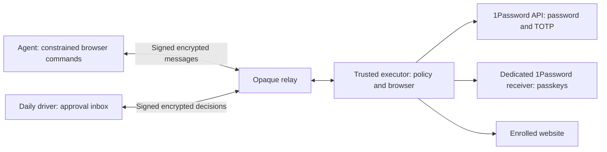

# Agent authentication and approvals

ChromeSync authentication uses a separate trusted executor. It owns the browser, credentials and policy store. Agents send signed, encrypted commands through the relay and receive constrained browser observations and fixed authentication outcomes. The daily driver runs an approval inbox; an existing persistent rule does not contact it.

The implementation includes encrypted approvals, a protected browser, password/TOTP delivery through the public SDK, and a normal-provider passkey bridge. Synthetic accounts pass the complete local integration suite in current Chrome for Testing. Real 1Password vault enrollment and service compatibility remain separate acceptance gates; a synthetic authenticator is not a verified 1Password deployment. Follow the [live acceptance runbook](authentication-acceptance.md) before relying on it for an account.

## Deployment roles

| Device | Authority |
| --- | --- |
| Executor | Protected Chrome processes, scoped 1Password integration, encrypted request/policy store. |
| Agent | Its own identity and relay channel; enrolled account aliases, browser operations and authentication request/status/cancel. |
| Approver | Separate identity for request decisions, persistent permissions and trusted enrollment. |
| Relay | Opaque encrypted envelopes and channel admission. It has no vault decryption key or authority to approve. |

Use a separate Mac or Linux host for the executor, outside the browsing agent's shell, filesystem and process authority. A second process under an unrestricted agent's own account does not meet the isolation requirement. Existing `chromesync endpoint` cookie-sync profiles remain raw-CDP sessions; use `chromesync auth` for protected sessions. There is no automatic migration of an arbitrary agent-modified profile into protected mode.

The approval inbox also requires a trusted environment. Its loopback listener trusts local clients: Host/Origin checks and CSRF protection do not authenticate a shell process on that machine. Separate ChromeSync directories or ordinary OS users alone do not isolate this listener. If agents run on the approval computer, confine them to a VM or sandbox that cannot reach the host's loopback inbox, Keychain, approval files, browser/desktop controls or administrative interfaces. Until that separation is established, use the executor's local trusted inbox or another trusted approval device.



Install Node 22+, Chrome and the OS credential-store requirements from [installation](install.md). Install the pinned executor dependency from the repository root:

```sh
npm ci --prefix auth --ignore-scripts
```

The public SDK is pinned to `@1password/sdk` 0.5.0. No account data is fetched during installation. Password/TOTP uses ordinary Chrome; the passkey forwarding extension requires Chrome for Testing or Chromium with supported extension loading. The integration does not disable browser checks to make branded Chrome accept unsupported flags.

## Pair devices

Run this on the executor:

```sh
chromesync auth init --role executor
chromesync auth identity
```

On each agent and approval device, initialize the corresponding role and export a public pairing request:

```sh
chromesync auth init --role approver
chromesync auth pairing-request --output /private/approval.request.json
```

Use `--role agent` on the agent host. Transfer the public request to the executor and compare the entire displayed fingerprint through a trusted channel. Then run on the executor:

```sh
chromesync auth pair --request-file /private/approval.request.json \
  --fingerprint REQUESTER_FINGERPRINT --relay https://YOUR-RELAY \
  --output /private/approval.activation.json
```

The relay operator must admit the printed room ID. Authentication uses independent rooms and keys; do not reuse cookie-sync room credentials. Transfer the encrypted activation to the requesting device and compare the executor fingerprint:

```sh
chromesync auth activate --activation-file /private/approval.activation.json \
  --fingerprint EXECUTOR_FINGERPRINT
```

Requests and activations expire after 15 minutes. The role is included in the fingerprint; an agent cannot promote itself to an approver. Private keys, channel tokens, provider tokens and the local state-encryption key live in the OS credential store. Pairing artifacts do not contain plaintext vault credentials.

## Start the executor and inbox

On the executor, run `chromesync auth executor`. On the daily driver, run `chromesync auth approvals`. Open the loopback inbox URL printed by that command. The inbox listener is bound to `127.0.0.1`, checks the exact Host/Origin, uses an HttpOnly SameSite cookie and CSRF token, and serves no third-party scripts.

The executor also offers a local inbox for initial setup. Keep this UI on a trusted host; do not expose its port through a public reverse proxy. Remote approval uses the enrolled approval identity through the encrypted relay.

Use `chromesync auth service install` on an initialized executor or approval device to run its role as a macOS/Linux user service. `chromesync auth inbox` shows its running local URL. `chromesync auth service uninstall` stops and removes only that authentication service. See [background service behavior](../auth/README.md). The OS credential store must be available to the user service; a locked keyring cannot supply unattended credentials.

Interactive authentication requires relay budgets above the existing cookie-snapshot defaults. A dedicated authentication deployment can start with `RATE_IP_CAPACITY=120`, `RATE_IP_REFILL=20`, `RATE_ROOM_CAPACITY=120`, and `RATE_ROOM_REFILL=10`, while retaining room admission, size limits, quotas and expiry. Tune for the number of devices and expected browser operations. The client backs off on rate limits; executor polling is bounded by peer count. This version uses polling, so it is not instant push delivery.

## Enroll passwords and TOTP

1. Create a custom 1Password vault containing only the accounts you want to enroll. Provision a read-only service account for that vault. Personal/default vault restrictions are documented by [1Password](https://www.1password.dev/service-accounts/get-started).
2. Open **Services & devices → Connect a 1Password service account** in the trusted inbox. Enter the token there. Never paste it into an agent conversation or shell argument. It is sent encrypted to the executor and saved in its OS credential store.
3. Add a service configuration. Use the example in the inbox as a starting point; replace its origins, item/field IDs and form selectors with tested values. Account names are aliases shown to the agent, not vault enumeration.

The provider resolves exact enrolled fields. An OTP reference requests the generated code using `?attribute=otp`; it does not fetch a whole item or the seed. TOTP is requested at its actual form step, with a rollover margin. Set `totpPeriodSeconds` if the enrolled service uses a period other than 30 seconds. Clock health remains an operator dependency.

Form automation is explicit: each flow has a purpose (`login` or `reauthentication`), a visible challenge selector, bounded fill/click/wait steps and an exact success condition. Origin checks apply at each step. Separate IdP, API and resource origins must be enrolled deliberately; unapproved network destinations and subframe documents are blocked. A successful credential lookup is not treated as successful authentication.

Success must verify the expected account as well as a signed-in page. Every flow requires `success.account`, for example `{ "selector": "[data-account-id]", "attribute": "data-account-id", "value": "EXPECTED_ACCOUNT_ID" }`. Without `attribute`, the executor compares the selected element's trimmed visible text exactly. Select one visible, stable identity marker supplied by the service; a generic “logged in” heading is insufficient. The expected identity is private configuration and is redacted from agent observations. Wrong-account selection stays unresolved, including during passkey use and owner takeover.

## Agent workflow

```sh
chromesync auth services
chromesync auth open --service acme-work
chromesync auth observe --session SESSION_ID
chromesync auth request --session SESSION_ID --service acme-work --factors password,totp
chromesync auth status --request REQUEST_ID
```

`services` returns `{items,nextCursor,hasMore}`. Pass `--cursor` to retrieve another page. Owner request, permission and enrollment lists use the same bounded pagination. Requests covered by approval return `approved` promptly; poll `status` through `approved`/`authenticating` until a final outcome before continuing browser actions.

Normal interaction uses `navigate`, `observe`, `click` and `type`. Observations return opaque control handles. Credential fields cannot be typed by agents, and no evaluation, raw DOM, cookies, network bodies, profile paths or CDP endpoint is exposed. During authentication all agent observation/control is blocked. Failed or uncertain fills quarantine the session until verified recovery or closure.

The agent supplies a session handle and account alias. The executor derives the actual browser origin, challenge and purpose. It never trusts an agent's claim that a request is merely routine sign-in.

For SMS, unknown forms or other manual steps, the owner can choose **Complete in protected browser**. A private viewport with click/type/keyboard controls is delivered only to that authenticated approval device while the agent is paused. **Verify and resume agent** requires an enrolled success and account marker and no remaining challenge. Failure, expiry or stopping takeover leaves the session quarantined. The same approver can reopen a live takeover after reloading its inbox. Native OS dialogs require access to the actual trusted device.

For failed or unresolved requests, **Review and retry** re-inspects the browser and creates a new request that requires a fresh decision, including when a saved permission exists. An already authenticated browser is verified without repeating the ceremony. A changed enrollment or unknown challenge cannot reuse the old approval. Denial can also interrupt an active ceremony; it cannot undo a submission already accepted by the website.

Outcomes include `pending`, `approved`, `authenticating`, `succeeded`, `needs-user`, `denied`, `cancelled`, `expired` and `failed`. A transport timeout returns `uncertain` with a command ID: it does not prove the browser action never ran. Do not blindly repeat a sensitive click or submission after an uncertain result. Durable command records prevent delivery retries from re-executing a committed mutation; interrupted commands require state inspection.

## Decisions and persistent permission

The inbox shows the service origin, account, requester, requested factors and purpose. A decision can deny, allow once, or save selected factor permissions until expiry/revocation. Allowing a password does not silently allow TOTP. When selected factors do not cover the requested ceremony, the broker records that additional approval is required instead of supplying the omitted factor.

Persistent permissions bind account, requester, exact origin, enrollment revision, factors and purpose. Changing enrollment invalidates old permissions. Routine login permission does not automatically authorize sensitive reauthentication. Revoking an active permission aborts further form operations; it cannot undo a submission the website already accepted.

An executor restart marks interrupted authentication uncertain. There is no automatic retry of an ambiguous sensitive action. Deny/cancel/expiry and provider failures do not produce success. The approved ceremony has a maximum 120-second execution window; password flows default to 30 seconds and passkey flows to 120 seconds. A website may grant a whole session a temporary privileged window; an authentication decision alone is not a guarantee that only one subsequent transaction can occur.

Ordinary terminal request results are retained for 30 days. At the 5,000-request count limit or under storage pressure, the oldest eligible terminal results and inactive policies may rotate after a minimum 15-minute replay window. Open requests and outcomes marked `authentication-uncertain` are not silently removed. A rotated request returns `not-found`; this is not evidence that its action never occurred.

Resource admission is bounded: eight browsers globally/four per requester by default, 100 open requests per requester/1,000 globally, 100 enrollments, 1,000 active policies and 128 paired device records. Each enrollment is at most 64 KiB; lists use pages of 20 by default, at most 50 and 96 KiB. Persistent growth stops at 4 MiB beneath an 8 MiB snapshot ceiling, reserving room for completion and cleanup. The audit tail is bounded to 2,000 entries/256 KiB; command history has separate limits and reserved owner cleanup capacity. Capacity failures are explicit, and owner reads, denial and revocation remain available for supported states. An oversized externally modified store is not automatically repaired by deleting unresolved authority.

## Existing 1Password passkeys

The dedicated receiver setup is performed on the trusted executor:

```sh
chromesync auth passkey-setup \
  --chrome '/absolute/path/to/Chrome for Testing' \
  --origins https://service.example
```

This opens a new, marked receiver profile. Install the official 1Password extension there and sign in with a member/guest identity restricted to the enrolled vault. Do not sign in to the owner's entire account and rely on a vault-visibility filter for access control. Finish setup before starting the executor.

A passkey service uses `provider: "passkey"`, `factors: ["passkey"]` and a flow step such as `{ "type": "passkey", "selector": "#use-passkey" }`, followed by a verified success condition. The sender proxy preserves the original request; the receiver calls normal WebAuthn at the genuine origin and allows the unchanged provider to perform its ceremony. No passkey private key crosses the relay or reaches the agent.

The receiver opens the enrolled `startUrl` by default. Set `passkey: { "receiverUrl": "https://accounts.example.com/login" }` when it needs another page at that same exact origin, such as when `/` redirects elsewhere. This URL comes only from owner enrollment. Passkey flows must match and invoke WebAuthn at the `startUrl` origin; an incompatible origin is rejected during enrollment. For an identity provider, enroll its login URL as `startUrl` and list the application's separate return origin when needed.

The first implementation supports top-level same-origin ceremonies and one active receiving profile at a time. Unvalidated WebAuthn extensions, conditional mediation and cross-origin frames are rejected. Provider unlock/selection and user verification may still require interaction. Missing receiver enrollment returns `needs-user`; a broker policy never invents a biometric verification. See [passkey integration](../auth/passkeys/README.md) for exact tests and limitations.

After passkey approval, the inbox opens **1Password on the executor**. It can show the dedicated receiver's service page and the official extension's popup, with opaque window handles and protected click/text/key controls. Images are sent only to an authenticated approver during that live approved ceremony and are excluded from the persistent command journal. Completion is checked against the original browser's challenge and expected account. A separate operating-system biometric prompt is not captured or bypassed by this view.

## Offline behavior and phone approvals

With a valid persistent rule, an online executor can use the service-account API while the daily driver is off. The executor still needs its own unlocked credential store and provider connectivity. Public SDK access to existing passkeys is unavailable; the independently enrolled normal provider is the passkey path. Unattended provider lock/restart behavior needs live validation.

Requests requiring a new decision wait for an enrolled approver for up to five minutes, then expire. The agent must inspect the outcome and create a fresh request if approval is still needed. SMS, email, authenticator push, number matching and hardware touch are not supplied by TOTP permission. They require the actual factor and protected user interaction.

The protocol separates approval from execution so a later phone app can reuse it: enroll a device key, fetch the bound request, sign a decision, and let the online executor act. APNs/FCM delivery and a native phone app are not implemented by this desktop inbox. Notification delivery would only wake the client; it would not itself approve anything.

## Verification

Run the fast authentication checks with Node 22 and permission for local listeners:

```sh
node --import ./test/keychain-fixture.js --test 'test/auth-*.test.js'
```

For required browser integration, install the locked SDK dependency and run:

```sh
npm ci --prefix auth --ignore-scripts
CHROMESYNC_TEST_CHROME='/absolute/path/to/Chrome for Testing' npm run test:auth:e2e
```

The strict entrypoint enables every browser test and fails if a compatible browser or the pinned SDK is missing. The dedicated authentication CI workflow runs this suite on macOS/Linux with a pinned, checksum-verified Chrome for Testing download. Release builds depend on both the existing regression workflow and authentication integration. Hosted CI has to run on the repository before its results can be claimed.

The fixture replaces only OS credential storage for tests and is not shipped as a production backend. Browser tests use disposable synthetic accounts, temporary profiles and virtual authenticators. Verify a real, deliberately enrolled 1Password test vault before declaring a deployment compatible with its services. The acceptance record is [auth/IMPLEMENTATION.md](../auth/IMPLEMENTATION.md).
