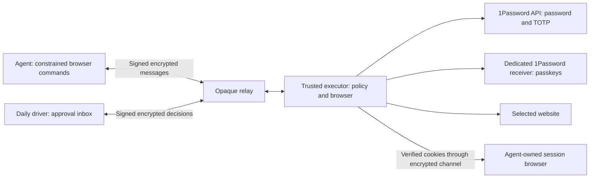

# Agent authentication and approvals

Connect a scoped 1Password vault once, then let an agent search for an account by website and item name. The agent selects an opaque account handle, identifies the login controls, and requests permission. A separate trusted executor fills credentials in an isolated browser; after verified login, the agent can import that session's cookies into its own managed browser. Ordinary login does not require a JSON adapter for each account.

The executor owns the protected browser, provider credentials and policy store. Signed, encrypted commands pass through the relay. The daily driver supplies decisions through its approval inbox; a matching persistent permission can run without contacting it. Some websites still require owner verification or a tested custom flow.

The implementation includes encrypted approvals, a protected browser, password/TOTP delivery through the public SDK, and a normal-provider passkey bridge. Synthetic accounts pass the complete local integration suite in current Chrome for Testing. Real 1Password vault enrollment and service compatibility remain separate acceptance gates; a synthetic authenticator is not a verified 1Password deployment. Follow the [live acceptance runbook](authentication-acceptance.md) before relying on it for an account.

## Deployment roles

| Device | Authority |
| --- | --- |
| Executor | Protected Chrome processes, scoped 1Password integration, encrypted request/policy store. |
| Agent | Its own identity and relay channel; disclosed account titles/origins, constrained login controls, requests, and approved session handoff. |
| Approver | Separate identity for request decisions, persistent permissions and trusted enrollment. |
| Relay | Opaque encrypted envelopes and channel admission. It has no vault decryption key or authority to approve. |

Use a separate Mac or Linux host for the executor, outside the browsing agent's shell, filesystem and process authority. A second process under an unrestricted agent's own account does not meet the isolation requirement. Existing `chromesync endpoint` cookie-sync profiles remain raw-CDP sessions; use `chromesync auth` for protected sessions. Discovery starts a fresh protected profile. Handoff sends authenticated cookies to a separate agent-owned profile; it does not import an arbitrary agent-modified browser into the trusted executor.

The approval inbox also requires a trusted environment. Its loopback listener trusts local clients: Host/Origin checks and CSRF protection do not authenticate a shell process on that machine. Separate ChromeSync directories or ordinary OS users alone do not isolate this listener. If agents run on the approval computer, confine them to a VM or sandbox that cannot reach the host's loopback inbox, Keychain, approval files, browser/desktop controls or administrative interfaces. Until that separation is established, use the executor's local trusted inbox or another trusted approval device.



Install Node 22+ with npm, Chrome and the OS credential-store requirements from [installation](install.md). Verified installs and updates provision and import-check the pinned SDK before activation. For a source checkout, install it from that repository root:

```sh
npm ci --prefix auth --ignore-scripts
```

The public SDK is pinned to `@1password/sdk` 0.5.0. No account data is fetched during installation. Password/TOTP uses ordinary Chrome; the passkey forwarding extension requires Chrome for Testing or Chromium with supported extension loading. The integration does not disable browser checks to make branded Chrome accept unsupported flags.

## Pair devices

Run this on the executor:

```sh
chromesync auth init --role executor
chromesync auth identity
```

On each agent and approval device, initialize the corresponding role and export a public pairing request:

```sh
chromesync auth init --role approver
chromesync auth pairing-request --output /private/approval.request.json
```

Use `--role agent` on the agent host. Transfer the public request to the executor and compare the entire displayed fingerprint through a trusted channel. Then run on the executor:

```sh
chromesync auth pair --request-file /private/approval.request.json \
  --fingerprint REQUESTER_FINGERPRINT --relay https://YOUR-RELAY \
  --output /private/approval.activation.json
```

The relay operator must admit the printed room ID. Authentication uses independent rooms and keys; do not reuse cookie-sync room credentials. Transfer the encrypted activation to the requesting device and compare the executor fingerprint:

```sh
chromesync auth activate --activation-file /private/approval.activation.json \
  --fingerprint EXECUTOR_FINGERPRINT
```

Requests and activations expire after 15 minutes. The role is included in the fingerprint; an agent cannot promote itself to an approver. Private keys, channel tokens, provider tokens and the local state-encryption key live in the OS credential store. Pairing artifacts do not contain plaintext vault credentials.

## Start the executor and inbox

On the executor, run `chromesync auth executor`. On the daily driver, run `chromesync auth approvals`. The first inbox port is saved and reused, preserving the browser notification permission for that loopback origin. `--port` overrides and updates it. If a saved port is occupied, startup uses a new ephemeral port and reports `portFallback: true`; enable notifications again on that new origin. Open the loopback inbox URL printed by that command. The inbox listener is bound to `127.0.0.1`, checks the exact Host/Origin, uses an HttpOnly SameSite cookie and CSRF token, and serves no third-party scripts.

Use **Enable notifications** in the inbox header to grant browser notification permission. Each newly observed pending request, including those present when the inbox first opens, generates one tagged notification. The title and application badge show the total open count; an optional chime plays after a user gesture has enabled audio. Keep the inbox open for browser notifications. Notification delivery remains subject to the browser and operating system's notification/focus settings.

Headless approvers can run `chromesync auth approvals --watch --interval 15`; the minimum interval is five seconds. It prints one JSON pending event per newly seen request and sends a terminal bell to stderr. `chromesync auth requests` lists one page, and `chromesync auth decide --request REQUEST_ID --decision once|always|deny [--factors password,totp]` makes an owner decision. These commands require an approver identity.

The executor also offers a local inbox for initial setup. Keep this UI on a trusted host; do not expose its port through a public reverse proxy. Remote approval uses the enrolled approval identity through the encrypted relay.

Use `chromesync auth service install` on an initialized executor or approval device to run its role as a macOS/Linux user service. After the service has started, `chromesync auth inbox` shows its local URL. Startup is asynchronous; if the inbox record is not ready, retry briefly and inspect the foreground command if it remains unavailable. `chromesync auth service uninstall` stops and removes only that authentication service. See [background service behavior](../auth/README.md). The OS credential store must be available to the user service; a locked keyring cannot supply unattended credentials.

Interactive authentication requires relay budgets above the existing cookie-snapshot defaults. A dedicated authentication deployment can start with `RATE_IP_CAPACITY=120`, `RATE_IP_REFILL=20`, `RATE_ROOM_CAPACITY=120`, and `RATE_ROOM_REFILL=10`, while retaining room admission, size limits, quotas and expiry. Tune for the number of devices and expected browser operations. The client backs off on rate limits; executor polling is bounded by peer count. The transport still polls the relay; server-held agent waits remove repeated agent status commands, but delivery latency still includes executor/caller relay checks. Shipped rate-limit defaults are unchanged. Read-only timeouts discard their queued request blobs; mutation timeouts preserve replay delivery. Persistent HTTP 507 returns `uncertain/relay-capacity`. Rejected-envelope counts report clock/key problems without message contents.

## Connect a vault once

1. Create a custom 1Password vault containing only accounts available to this integration. Give a service account read-only access to that vault. Service accounts cannot access the built-in Personal, Private, Employee or default Shared vaults; the vault restriction is enforced by 1Password. See [service account setup](https://www.1password.dev/service-accounts/get-started).
2. Open **Vault & devices** in the trusted inbox and connect the service account. Enter the token only in that owner UI. The executor validates SDK authentication and builds the accessible vault metadata catalog before saving it in its OS credential store. A rejected candidate does not replace an existing connection. Never paste the token into an agent conversation or command argument.
3. Enable account discovery for the connection. Agents can now search accounts by exact website origin and optional item name. There is no per-account JSON setup for a standard login. Use distinct item titles when you have several accounts at the same site; usernames are not exposed by search.

The inbox remembers its selected tab in the URL fragment and loads saved connections independently of requests, accounts and devices when Vault & devices is selected. Connection polling is limited to once per 30 seconds and pauses during protected interaction; request refreshes occur about every three seconds while the browser tab is visible and ten seconds while hidden. An empty token field after refresh is expected. Each saved card reports whether the executor has a credential, without returning that credential. A failed status poll preserves the last confirmed cards; an initial failure says status is unknown rather than showing an empty vault. After an executor restart, a saved connection is shown as unchecked until discovery or **Check connection** verifies it.

Use **Check connection** to revalidate the stored token and rebuild the catalog immediately, including after a failed refresh. The owner sees fixed diagnostic codes for a missing SDK, invalid/rejected authentication, vault or item access, network failures and capacity. Agents still receive a generic `catalog-provider-unavailable` result. A successful reconnect clears the previous catalog failure backoff. Upgrade and restart both the executor and approver when adopting this provider-status API; old executor versions do not supply the new credential-presence projection.

Search reads item overviews and returns only bounded titles, website origins, exact-origin/name match reasons and temporary opaque handles. It does not return usernames, passwords, TOTP seeds or codes. The executor builds this metadata index during connection validation or on demand, caches it for five minutes, and returns at most 20 results per page. A synthetic 3,000-item catalog is tested; the index has a 20,000-item cap. This uses the SDK's [vault and item listing API](https://www.1password.dev/sdks/list-vaults-items). Account titles are deliberately disclosed metadata, so do not put secrets in them.

Selecting a password account privately calls the SDK's `items.get` to infer the username, password and optional TOTP field references. **That selected-item read includes its values inside the trusted SDK/executor before fill approval.** Values are neither returned to the agent nor retained in the catalog. Approval gates credential use in the browser, rather than this private schema read. See the SDK's [item retrieval API](https://www.1password.dev/sdks/manage-items). Factors are reported after this selected-account schema inspection. Ambiguous or unsupported item fields require owner review.

Selection binds that fresh browser to one account and creates its internal enrollment; it grants no permission. Account handles are short-lived and bound to the requesting agent and exact origin. Selecting another account requires a fresh discovery browser. The provider retrieves approved fields again for the actual fill. A TOTP code is resolved at its form step, with a rollover margin; the seed never reaches the agent. Clock health and [1Password service account quotas](https://www.1password.dev/service-accounts/rate-limits) remain deployment dependencies.

Disabling discovery stops new searches and selections, but existing accounts and saved permissions can still use the credential. **Remove connection** drops the stored token first, revokes the connection's saved permissions, cancels open requests with `provider-removed`, and removes selected accounts and browser services. Removal is refused during catalog work. `provider-cleanup-incomplete` means the credential is gone but some cleanup failed; retry removal and check executor cleanup. Reconnecting the same ID requires fresh selection and approval and never restores revoked grants.

## Agent workflow

```sh
chromesync auth open --url https://service.example/login
chromesync auth search --session SESSION_ID --query 'Work account'
chromesync auth select --session SESSION_ID --item ITEM_HANDLE
chromesync auth observe --session SESSION_ID
chromesync auth request --session SESSION_ID --revision REVISION --factors password,totp
chromesync auth wait --request REQUEST_ID
# Only after status is succeeded:
chromesync auth handoff --session SESSION_ID --name service-work --headless
chromesync auth close --session SESSION_ID
```

Use the values returned by each command. `search --url https://service.example/login --query 'Work account'` can inspect metadata before opening a browser. `search` and `services` return `{items,nextCursor,hasMore}`; use `--cursor` for the next page. `open --service SERVICE_ID` reuses an already selected enrollment. Observe again after selection because it changes the session revision.

Observation gives opaque control handles and safe input roles, never input values. Standard username, password and single/split TOTP forms can be recognized privately. To choose among visible controls, supply observed handles:

```sh
chromesync auth request --session SESSION_ID --revision REVISION \
  --factors password,totp --username-handle USERNAME_HANDLE \
  --password-handle PASSWORD_HANDLE --submit-handle SUBMIT_HANDLE
```

Include only fields currently present; a username-only first page does not need a password handle. For a split code, `--totp-handles HANDLE1,HANDLE2,HANDLE3,HANDLE4,HANDLE5,HANDLE6` preserves digit order. Handles must still refer to the same live controls and form. The executor follows subsequent standard steps privately, up to eight steps within 120 seconds. Changed controls, ambiguous forms, password-change fields and credential submissions to another origin are rejected. Adaptive pages may load public HTTPS subresources; top-level navigation remains at the selected exact origin and subframe documents are blocked. A separate identity provider therefore needs its own login-origin session or an advanced owner-configured flow.

Requests covered by a decision return `approved` promptly. Use `auth wait --request REQUEST_ID` through `approved`/`authenticating` until the final outcome before continuing. `auth status` remains a one-shot check. Each server-held wait wakes after the next committed state change; the CLI continues until a terminal outcome or its default 300-second deadline (`--timeout SECONDS`). An unchanged deadline returns `timedOut: true` with exit code zero. Waits are limited to two per requester and sixteen globally; `wait-capacity` asks callers to back off. Each relay hop is bounded to 100 seconds, and executor shutdown releases waits. Normal protected interaction uses `navigate`, `observe`, `click` and `type`; agents cannot type credential fields or use evaluation, raw DOM, network bodies, profile paths or CDP. Every agent observation and control channel pauses during authentication. Failed or uncertain fills quarantine the session until recovery or closure.

Successful credential submission alone does not prove the selected account is signed in. Adaptive verification requires the private username to match an exact visible account indicator outside the form, or an owner-configured verification rule. Generic welcome pages and redirects return `needs-user` with `VERIFICATION_REQUIRED`. For those sites, the owner uses **Complete in protected browser**, checks the account, and explicitly confirms the authenticated state. That confirmation applies only to the current session/document; it does not silently learn a persistent verification rule. A new login challenge invalidates it, including inside a single-page app.

Both protected source and passkey receiver views capture continuously, normally about one frame per 1.5–3 seconds over the relay. Captures schedule after the preceding call settles, back off to five seconds on failure, and show a waiting status. Calls are bounded to 30 seconds; manual refresh remains available and owner actions take priority over the next scheduled capture. Request and provider refreshes pause during takeover. JPEG observations do not enter the durable command journal. Oversized responses return `response-capacity` promptly.

Takeover leases slide ten minutes on each owner action/observation, with an absolute 30-minute maximum. The view shows a countdown in its final minute; reopening starts a fresh lease. At most two takeovers per approver and eight globally can be starting or active. Inactive protected sessions are reaped after 15 minutes, excluding active operations and authentication/takeover leases. A request can outlive its browser: `sessionOpen: false` hides its takeover action, and `session-closed` asks the agent to open a new session. Closing a browser does not undo a website submission.

The same protected owner view handles SMS or unfamiliar forms. Only the acting approver receives its viewport and click/type/keyboard controls while the agent is paused. An unfinished challenge, cancellation or timeout leaves the session quarantined. Native OS dialogs require access to the actual trusted device. Advanced configured flows still require their declared account marker before resuming.

For failed or unresolved requests, **Review and retry** re-inspects the browser and requires a fresh decision, including when a saved permission exists. An already authenticated browser can be verified without repeating the ceremony. Denial can interrupt an active ceremony but cannot undo a submission already accepted by the website.

Outcomes include `pending`, `approved`, `authenticating`, `succeeded`, `needs-user`, `denied`, `cancelled`, `expired` and `failed`. A transport timeout returns `uncertain` with a command ID; it does not prove the action never ran. Inspect state before repeating a sensitive click. Durable command records prevent delivery retries from re-executing committed mutations.

## Diagnostics

Agent outcomes and owner request views optionally include `diagnostic: { code, credentialsSupplied }`. Stored diagnostics also include a timestamp; audit entries retain transition reason, previous status and code. Codes are bounded uppercase identifiers, never page/provider messages or stack traces. Success clears the current diagnostic; retry history retains prior evidence. A rejection through the relay/inbox includes a validated code such as `SESSION_NOT_FOUND`, `SESSION_CLOSED`, `REQUESTER_REVOKED`, `SESSION_BUSY`, `TAKEOVER_NOT_FOUND` or `ENROLLMENT_UNAVAILABLE`; older peers without a code use `OPERATION_REJECTED`. CLI rejection output is fixed JSON.

| Reason or diagnostic | Agent/owner action |
| --- | --- |
| `authentication-uncertain`, `credentialsSupplied: true` | Credentials reached the page but login is unverified. Inspect the protected site before retrying; do not automatically rotate credentials or repeat submission. |
| `VERIFICATION_REQUIRED`, `SUCCESS_NOT_CONFIRMED`, `ACCOUNT_MISMATCH` | Check the actual signed-in account in the protected browser and confirm only the selected account. |
| `TOTP_UNAVAILABLE` | The site requested an authenticator code absent from the enrolled account. |
| `PASSWORD_CHANGE_FORBIDDEN` | Complete password changes yourself; automated login cannot perform them. |
| `EXPECTED_CONTROL_UNAVAILABLE` | The expected sign-in control is missing or changed. Inspect the current form. |
| `SESSION_CHANGED` / `session-changed` | The document or request binding changed. Observe again and obtain fresh approval where needed. |
| `AUTH_FLOW_UNAVAILABLE` / `unrecognized-authentication` | Use owner interaction for an unrecognized login flow. |
| `BROWSER_CLOSED`, `SESSION_NOT_FOUND` / `browser-unavailable`, `session-closed` | Open a new protected session and request again. |
| `AUTH_INVALID`, `AUTH_REJECTED`, `CREDENTIAL_MISSING` | Check the saved connection/token in Vault & devices. |
| `NETWORK_UNAVAILABLE`, `AUTH_UNAVAILABLE`, `CREDENTIALS_UNAVAILABLE`, `VAULTS_UNAVAILABLE`, `ITEMS_UNAVAILABLE`, `RATE_LIMITED` | Check executor connectivity and scoped provider access; respect the provider's retry time. |
| `SDK_UNAVAILABLE`, `SDK_INVALID`, `VAULT_ACCESS_MISSING`, `CATALOG_CAPACITY`, `CONNECTION_CHANGED` | Repair the executor SDK or check the current connection and vault scope. |
| `PAGE_TIMEOUT`, `FLOW_TIMEOUT`, `AUTHENTICATION_RETRY_REQUIRED` | Inspect the current page before retrying a timed-out or changed challenge. |
| `CREDENTIAL_LEASE_ENDED`, `ABORTED`, `STORE_UNAVAILABLE` | The credential operation was interrupted or persistence failed. Confirm state before retrying. |
| `FILL_FAILED`, `AUTHENTICATION_FAILED`, `AUTHENTICATION_NOT_COMPLETED` | Safe generic fill diagnostics; inspect the protected browser. `authentication-failed` is retained for older providers returning no code. |
| `interaction-required`, `provider-unsupported`, `provider-unavailable` | Owner interaction, a supported factor or a repaired provider connection is required. |
| `wait-capacity`, `takeover-capacity`, `relay-capacity`, `response-capacity` | Back off, close unused views or reduce the response; do not infer that a timed-out mutation never ran. |
| `provider-removed`, `provider-cleanup-incomplete`, `provider-removal-unconfirmed` | Reconnect only after checking removal/cleanup state; old grants must be retired before a replacement token is saved. |

## Session handoff

`auth handoff` transfers cookies through the encrypted channel directly into a local managed browser. Cookie values are not printed as CLI JSON or written to an export file. The destination profile is pinned to the selected account and exact origin; reusing a profile for another account is rejected. It becomes an ordinary agent-owned browser, so the agent receives the resulting website session authority.

Export requires a verified, current protected session with no active lease. It includes at most 200 cookies for the current exact hostname (or its matching domain-cookie form), within 80 KiB. The URL includes only origin and path. Credential echoes, a changed browser document or changed verification state abort the export. Cookies for parent domains, sibling hosts, unrelated services, local storage and IndexedDB are not transferred. Device-bound sessions and sites needing omitted state may require continued work in the protected browser; cookie import is not proof that every site will accept a migrated session. Closing the protected session does not revoke a session already imported into the agent browser.

## Advanced configured flows

Owner-authored service JSON remains supported for nonstandard sites and explicit `login`/`reauthentication` purposes. The inbox example supplies the schema: exact origins, item/field IDs, a challenge selector, bounded fill/click/wait steps and a success condition. Enroll any additional IdP, API or resource origins deliberately; configured flows do not inherit adaptive public-subresource access.

Every configured flow requires `success.account`, for example `{ "selector": "[data-account-id]", "attribute": "data-account-id", "value": "EXPECTED_ACCOUNT_ID" }`. Without `attribute`, the selected element's trimmed visible text must match exactly. The expected identity is private and redacted from agent observations. A generic signed-in heading is insufficient. An adaptive enrollment may instead retain an owner-provided `authentication.verification` rule with the same selector/value/optional data-attribute shape. Agent input cannot set expected identity or trusted verification rules.

## Decisions and persistent permission

The inbox shows the service origin, account, requester, requested factors and purpose. A decision can deny, allow once, or save selected factor permissions until expiry/revocation. Allowing a password does not silently allow TOTP. When selected factors do not cover the requested ceremony, the broker records that additional approval is required instead of supplying the omitted factor.

Persistent permissions bind account, requester, exact origin, enrollment revision, factors and purpose. Changing enrollment invalidates old permissions. Routine login permission does not automatically authorize sensitive reauthentication. Revoking an active permission aborts further form operations; it cannot undo a submission the website already accepted.

An executor restart marks interrupted authentication uncertain. There is no automatic retry of an ambiguous sensitive action. Deny/cancel/expiry and provider failures do not produce success. The approved ceremony has a maximum 120-second execution window. Adaptive and passkey flows default to 120 seconds; advanced password flows default to 30 seconds. A website may grant a whole session a temporary privileged window; an authentication decision alone is not a guarantee that only one subsequent transaction can occur.

Ordinary terminal request results are retained for 30 days. At the 5,000-request count limit or under storage pressure, the oldest eligible terminal results and inactive policies may rotate after a minimum 15-minute replay window. Open requests and outcomes marked `authentication-uncertain` are not silently removed. A rotated request returns `not-found`; this is not evidence that its action never occurred.

Resource admission is bounded: eight browsers globally/four per requester by default, 100 open requests per requester/1,000 globally, 5,000 used account enrollments, 1,000 active policies and 128 paired device records. Each enrollment is at most 64 KiB; lists use pages of 20 by default, at most 50 and 96 KiB. The shared persistent store stops admitting growth at 4 MiB beneath an 8 MiB snapshot ceiling, reserving room for completion and cleanup. This byte cap can be reached before all 5,000 enrollment slots are used. The audit tail is bounded to 2,000 entries/256 KiB; command history has separate limits and reserved owner cleanup capacity. Capacity failures are explicit, and owner reads, denial and revocation remain available for supported states. An oversized externally modified store is not automatically repaired by deleting unresolved authority.

## Existing 1Password passkeys

The dedicated receiver setup is performed on the trusted executor:

```sh
chromesync auth passkey-setup \
  --chrome '/absolute/path/to/Chrome for Testing' \
  --origins https://service.example
```

This opens a new, marked receiver profile. Install the official 1Password extension there and sign in with a member/guest identity restricted to the enrolled vault. Do not sign in to the owner's entire account and rely on a vault-visibility filter for access control. Finish setup before starting the executor. The setup origin list scopes advanced services; a catalog discovery session binds its receiver to the actual selected HTTPS origin and still requires the corresponding account approval.

For discovery, open with `auth open --url https://service.example/login --method passkey`, search/select the item, then observe and request with `--factors passkey`; pass its button handle as `--submit-handle` if needed. The receiver starts at the discovery login URL. Catalog selection identifies an intended account from metadata; it cannot constrain which passkey the normal provider selects. Without a private account-verification rule, the owner must inspect and confirm the original authenticated account before session handoff.

An advanced JSON service uses `provider: "passkey"`, `factors: ["passkey"]` and a flow step such as `{ "type": "passkey", "selector": "#use-passkey" }`, followed by its exact account verification. The sender proxy preserves the original request; the receiver calls normal WebAuthn at the genuine origin and allows the unchanged provider to perform its ceremony. No passkey private key crosses the relay or reaches the agent.

For an advanced service, the receiver opens its enrolled `startUrl` by default. Set `passkey: { "receiverUrl": "https://accounts.example.com/login" }` when it needs another page at that same exact origin, such as when `/` redirects elsewhere. This URL comes only from owner enrollment. Passkey flows must match and invoke WebAuthn at the `startUrl` origin; an incompatible origin is rejected during enrollment. For an identity provider, enroll its login URL as `startUrl` and list the application's separate return origin when needed.

The first implementation supports top-level same-origin ceremonies and one active receiving profile at a time. Unvalidated WebAuthn extensions, conditional mediation and cross-origin frames are rejected. Provider unlock/selection and user verification may still require interaction. Missing receiver enrollment returns `needs-user`; a broker policy never invents a biometric verification. See [passkey integration](../auth/passkeys/README.md) for exact tests and limitations.

After passkey approval, the inbox opens **1Password on the executor**. It can show the dedicated receiver's service page and the official extension's popup, with opaque window handles and protected click/text/key controls. Images are sent only to an authenticated approver during that live approved ceremony and are excluded from the persistent command journal. Completion is checked against the original browser's challenge and expected account. A separate operating-system biometric prompt is not captured or bypassed by this view.

## Offline behavior and phone approvals

With a valid persistent rule, an online executor can use the service-account API for password/TOTP while the daily driver is off, provided that site's flow and account verification can finish automatically. A site requiring fresh owner confirmation cannot complete unattended merely because its password is always allowed. The executor still needs its own unlocked credential store and provider connectivity. Public SDK access to existing passkeys is unavailable; the independently enrolled normal provider is the passkey path. Unattended provider lock/restart behavior needs live validation.

Requests requiring a new decision wait for an enrolled approver for up to five minutes, then expire. The agent must inspect the outcome and create a fresh request if approval is still needed. SMS, email, authenticator push, number matching and hardware touch are not supplied by TOTP permission. They require the actual factor and protected user interaction.

The protocol separates approval from execution so a later phone app can reuse it: enroll a device key, fetch the bound request, sign a decision, and let the online executor act. APNs/FCM delivery and a native phone app are not implemented by this desktop inbox. Notification delivery would only wake the client; it would not itself approve anything.

## Verification

Run the fast authentication checks with Node 22 and permission for local listeners:

```sh
node --import ./test/keychain-fixture.js --test 'test/auth-*.test.js'
```

For required browser integration, install the locked SDK dependency and run:

```sh
npm ci --prefix auth --ignore-scripts
CHROMESYNC_TEST_CHROME='/absolute/path/to/Chrome for Testing' npm run test:auth:e2e
```

The strict entrypoint enables every browser test and fails if a compatible browser or the pinned SDK is missing. The dedicated authentication CI workflow runs this suite on macOS/Linux with a pinned, checksum-verified Chrome for Testing download. Release builds depend on both the existing regression workflow and authentication integration. Hosted CI has to run on the repository before its results can be claimed.

The fixture replaces only OS credential storage for tests and is not shipped as a production backend. Browser tests use disposable synthetic accounts, temporary profiles and virtual authenticators. Verify a real, deliberately enrolled 1Password test vault before declaring a deployment compatible with its services. The acceptance record is [auth/IMPLEMENTATION.md](../auth/IMPLEMENTATION.md).
